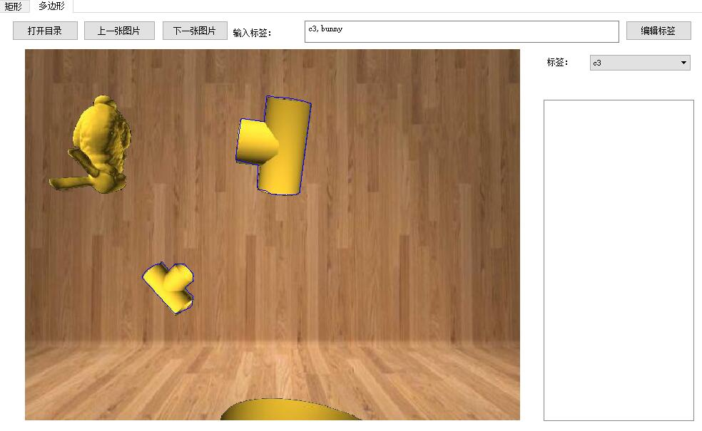
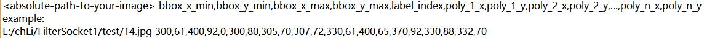
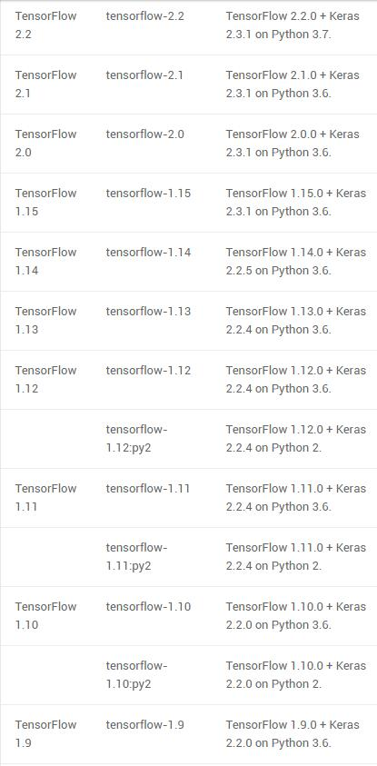
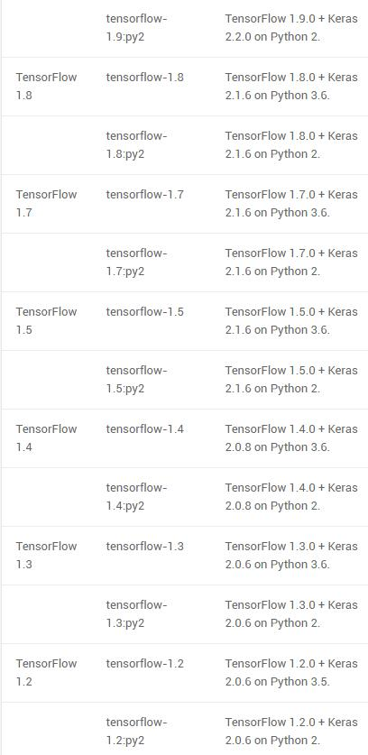
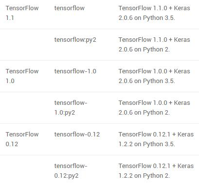
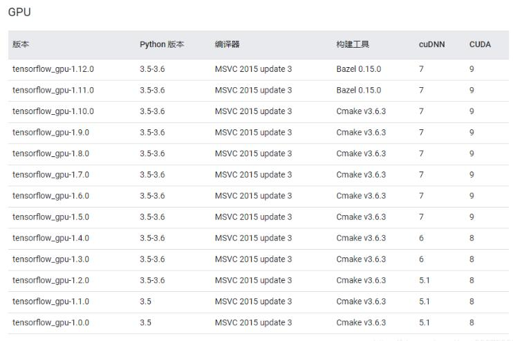

# poly-yolo

## 1 标定

### 1.1 Poly Mask

首先需要使用多边形进行数据标定，如下图所示



### 1.2 Mask Data Type

标定得到的数据应为如下所示格式

```c++
<absolute-path-to-your-image> bbox_x_min,bbox_y_min,bbox_x_max,bbox_y_max,label_index,poly_1_x,poly_1_y,poly_2_x,poly_2_y,...,poly_n_x,poly_n_y
example:
E:/chLi/FilterSocket1/test/14.jpg 300,61,400,92,0,300,80,305,70,307,72,330,61,400,65,370,92,330,88,332,70
```



并逐行排列写到名为 train.txt 的文本文件中

## 2 Environment

配置环境具有版本依赖的库包括：

```c++
tensorflow-gpu
keras
CUDA
CUDNN
```

经测试 tensorflow-gpu==1.15.0 与 keras==2.3.1 与 CUDA 10.0 与 CUDNN 7.6.5 for CUDA 10.0 可以成功运行GPU训练

### 2.1 tensorflow-gpu & keras

版本对应关系为







### 2.2 tensorflow-gpu & CUDA & CUDNN

版本对应关系为



## 3 Code Editing

```python
def _main():
    #把标定好的数据集分为两类，可以随机选取80%作为训练集放入train.txt，剩下20%作为测试机放入cal.txt
    annotation_path = 'E:/chLi/FilterSocket1/Server_DataBase/train_dataset/poly_yolo_dataset/train.txt'
    validation_path = 'E:/chLi/FilterSocket1/Server_DataBase/train_dataset/poly_yolo_dataset/val.txt'

    log_dir = os.getcwd() + '/poly_yolo/models/'
    classes_path = os.getcwd() + '/poly_yolo/yolo_classes.txt'
    anchors_path = os.getcwd() + '/poly_yolo/yolo_anchors.txt'

    ...

    batch_size = 6 #根据显存大小调整，越大占用显存越多训练收敛越快
```